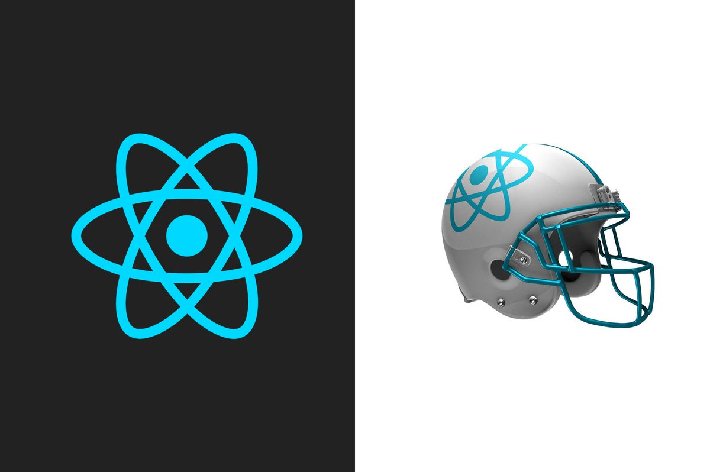

# Task Management Website

### Table of Contents

- [Prerequisites](#Prerequisites)
- [Tech Stack](#Tech-Stack)
- [Getting Started](#Getting-Started)
- [Project Structure](#Project-Structure)
- [Deployment](#Deployment)
- [Author](#Author)

#

### Prerequisites

-  _npm @8 and up_
-  _vite @4.0.0_
-  _typescript @4.9.3_

#

### Tech Stack

-  _React @18.2.0 - front-end framework_
-  _Styled-components @5.3.6 - visual primitives for the component age_
-  _React Router @6.7.0 - React library for routing_
-  _React Helmet @6.1.0 - library for write code in head from JSX_
-  _React Hook Form @7.43.2 - library for making forms_

#

### Getting Started

1. First of all you need to clone app repository from github:

```
git clone git@github.com:beqa200/task-management-website.git
```

2. Next step requires install all the dependencies.

```
npm install
```

3. To see project in action

```
npm run dev
```

#

### Project Structure

```
|--- src
|   |--- components # reusable components
|   |---|--- index.ts # export all components
|   |--- pages
|   |---|--- index.ts # export all pages
|   |--- styled-components # all components' styles
|   |---|--- components # reusable components
|   |---|--- GlobalStyle
|   |---|--- index.ts # export all components
|   |--- vite-env.d.ts # declare all types
|   |--- App.tsx # main page
- vercel.json # vercel file to make the routes work properly
- package.json     # dependency manager configurations

```

#

### Deployment

Before every deployment you need to create build file.

```
npm run build
```

after this you can use this file to deploy project on server.

#

### Author

- [LinkedIn](https://www.linkedin.com/in/beka-maisuradze-76a730234/)
